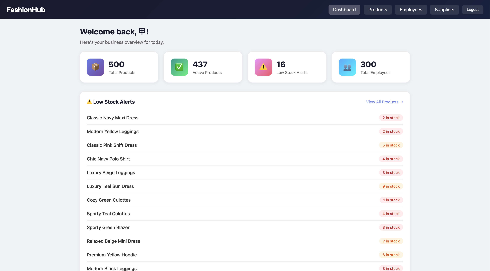

# FashionHub

A women's clothing brand management system with Product Catalog, Employee Management, and Supplier Management modules.

## Author

- **Xuyang Shen** — Product Catalog & Employee Management
- **Gaoyuan Shi** — Supplier Management

## Class

[CS5610 Web Development — Northeastern University](https://northeastern.instructure.com/courses/245751)

## Project Objective

FashionHub is an internal management tool for small women's clothing brands. It brings together three independent management modules into a single, clean, and fast web platform:

- **Product Catalog** — Track clothing products with inventory, pricing, categories, sizes, colors, and low-stock alerts
- **Employee Management** — Manage employee records by department, position, salary, and status
- **Supplier Management** — Organize vendor contacts with category filtering, star ratings, and performance notes
- **Dashboard** — Business overview with product statistics, low-stock alerts, and employee counts by department
- **User Authentication** — Register and login system to protect access

## Screenshot




## Tech Stack

- **Backend:** Node.js, Express 5
- **Database:** MongoDB Atlas (native driver, no Mongoose)
- **Frontend:** Vanilla HTML5, CSS3, JavaScript (client-side rendering)
- **Deployment:** Render

## Live Demo

[https://fashionhub-uopx.onrender.com/xuyang/](https://fashionhub-uopx.onrender.com/xuyang/)

## Instructions to Build

### Prerequisites

- Node.js >= 18
- MongoDB Atlas account (or local MongoDB instance)

### Setup

1. Clone the repository:

```bash
git clone https://github.com/xuyangshen0711/fashionhub.git
cd fashionhub
```

2. Install dependencies:

```bash
npm install
```

3. Create a `.env` file in the project root:

```
MONGODB_URI=your_mongodb_connection_string
PORT=3000
```

4. (Optional) Seed the database with sample data:

```bash
npm run seed
```

5. Start the server:

```bash
npm start
```

6. Open in browser:

```
http://localhost:3000/xuyang/
```

### Linting & Formatting

```bash
npm run lint
npm run format
```

## Project Structure

```
fashionhub/
├── public/
│   ├── gaoyuan/          # Supplier Management (Gaoyuan)
│   │   ├── css/
│   │   ├── js/
│   │   ├── index.html
│   │   └── suppliers.html
│   └── xuyang/           # Product & Employee Management (Xuyang)
│       ├── css/
│       ├── js/
│       ├── dashboard.html
│       ├── employees.html
│       ├── index.html
│       └── products.html
├── server/
│   ├── routes/
│   │   ├── auth.js
│   │   ├── employees.js
│   │   ├── products.js
│   │   └── suppliers.js
│   ├── db.js
│   ├── index.js
│   └── seed.js
├── .env
├── .eslintrc.js
├── .gitignore
├── .prettierrc
├── LICENSE
├── package.json
└── README.md
```
## Demo

Watch the demo video on YouTube：https://youtu.be/DQFNU-NE2Q0

## License

This project is licensed under the [MIT License](LICENSE).

